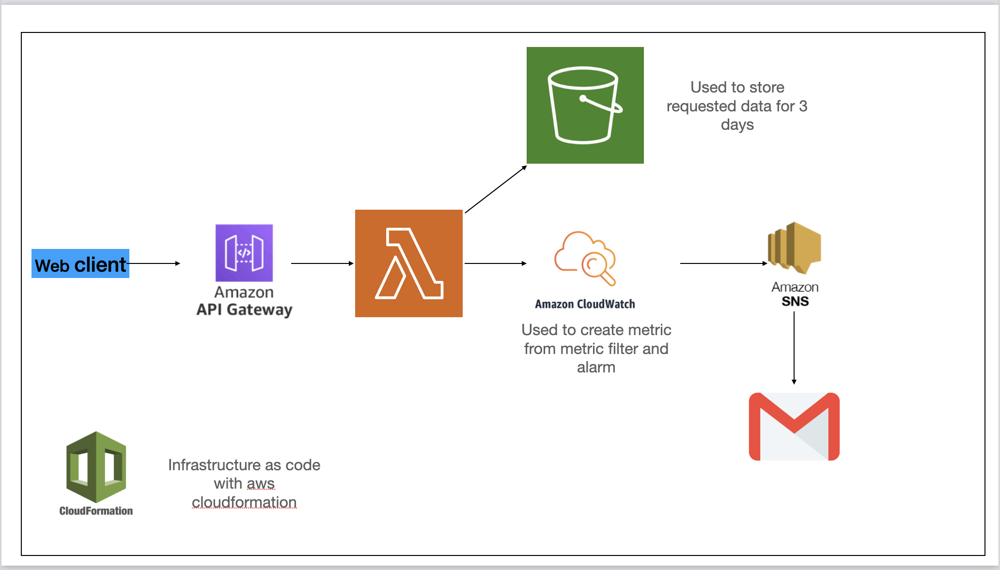

# Football Racing Barchart App
This project is an end-to-end implemntation of building a serverless archittecure to build an backend api pf football data for frontend web client.
## 📝 Table of Contents
- [System Architecture](#system-architecture)
- [Setup & Requirements](#-setup--requirements)
- [Usage](#-usage)
- [Notes](#-notes)

## System Architecture

## 🛠 Setup & Requirements
1. **Aws Account**: Ensure you have an active Azure account.
2. **Knowledge required**: Aws services (Api gateway, Lambda, Clouwatch, SNS, S3), frontend web development (js, css, html), python for backend and data analysis
3. **Python Libraries**: Install the required Python libraries:
   - pandas
   - boto3
   - numpy
   - certifi

## 🚀 Usage
1. **Store zip file of lambda function's components on S3**: Upload zip file named `lambda.zip` in a S3 bucket.
2. **Create aws physical resources with cloudformation**: Use YAML file named `setup.yaml` to create physical resources with aws Cloudformation.
3. **Resources with manual creation**: 
- Add aws-managed lambda layer for pandas so that lambda function can work correctly.
- Create an cloudwatch alarm attached to metric filter created for cloudwatch log group of api gateway access logging. Example config can be found in `alarm.yaml`.
- Also, a SNS topic needs to be created to use to send alarm to your chosen email.
4. **Frontend**: After all resources have been created, you can use the web client in the `client` directory to explore racing bar chart. But you need to change url to the apigate way route to able to fetch data.

## 📝 Notes
-  package `tools` includes `scraper.py` module used to scrape fixtures data and club names and `stats_extractor` module used to extract stats based on the scraped data 
- `assemble.py` module is used to create a function that accumulates the stats in form of points with goal difference and goals for racing bar chart while `constants.py` module stores related constant variables used in the project
